Class5 Data Exploration/Visualization in R
================
Justin Alvarez
2019-10-31

``` r
# Lec 5: DATA 
#Shortcut for # is ((ctrl+shift+c))

x <-rnorm(1000)

# Using help to understand rnorm
?rnorm
```

    ## starting httpd help server ... done

``` r
# Mean/Standard Deviation
mean(x)
```

    ## [1] -0.006461439

``` r
sd(x)
```

    ## [1] 1.000602

``` r
# 5 Number Summary (Extrema,Q1-Q3, Mean)
summary(x)
```

    ##      Min.   1st Qu.    Median      Mean   3rd Qu.      Max. 
    ## -3.120147 -0.706507 -0.013330 -0.006461  0.692352  2.862778

``` r
# Create Boxplot
# Q1-Q3= InterQuartile Range (IQR)
boxplot(x)
```

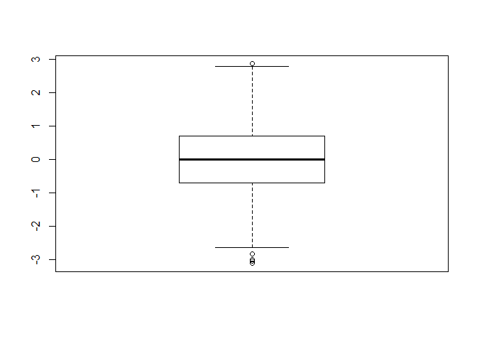<!-- -->

``` r
# Histogram
hist(x)

# Adds rug to bottom of histogram, looks pretty cool; essentially looks like boxplot on x axis
rug(x)
```

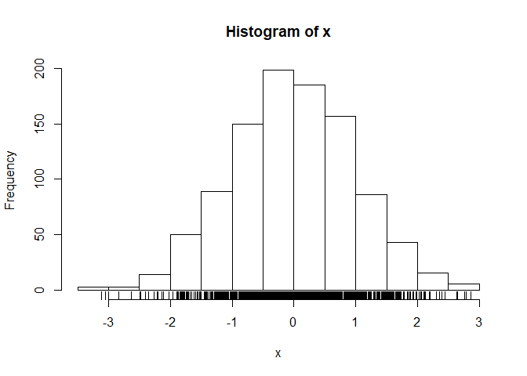<!-- -->

``` r
# Piecharts are the information visualization
# equivalent of a roofing hammer to the
# frontal lobe. They have no place in the world
# of grownups, and occupy the same semiotic
# space as short pants, a runny nose, and
# chocolate smeared on one’s face. They are as
# professional as a pair of assless chaps.

# assign variable to read.table; put quotes and then press tab to pull up the file you want to import; you'll know it's correct
# without setting header = TRUE, the table won't have headers and it'll look weird

W_tab <- read.table("bimm143_05_rstats/weight_chart.txt")
head(W_tab)
```

    ##    V1     V2
    ## 1 Age Weight
    ## 2   0    3.6
    ## 3   1    4.4
    ## 4   2    5.2
    ## 5   3      6
    ## 6   4    6.6

``` r
# Adding header=TRUE makes the columns have headers

W_tab <- read.table("bimm143_05_rstats/weight_chart.txt",header = TRUE)
head(W_tab)
```

    ##   Age Weight
    ## 1   0    3.6
    ## 2   1    4.4
    ## 3   2    5.2
    ## 4   3    6.0
    ## 5   4    6.6
    ## 6   5    7.2

``` r
# Plotting
# This gives scatterplot w/dots

plot(W_tab$Age, W_tab$Weight)
```

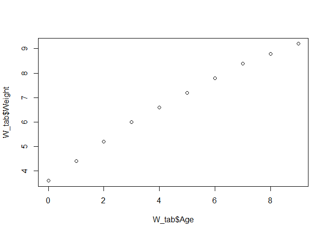<!-- -->

``` r
# Change to line using type="o"; this gives line and dots

plot(W_tab$Age, W_tab$Weight, type="o")
```

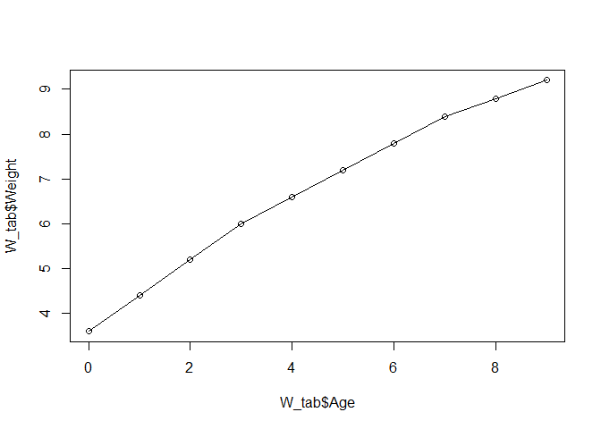<!-- -->

``` r
# change the point/dot to a filled in square
# using ,pch=15 (NO QUOTES FOR NUMBERS); pch = Plot CHaracters

plot(W_tab$Age, W_tab$Weight, type="o", pch=15)
```

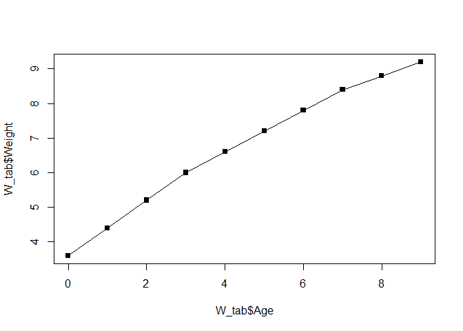<!-- -->

``` r
# Increase size of points with cex=1.5

plot(W_tab$Age, W_tab$Weight, type="o", pch=15, cex=1.5)
```

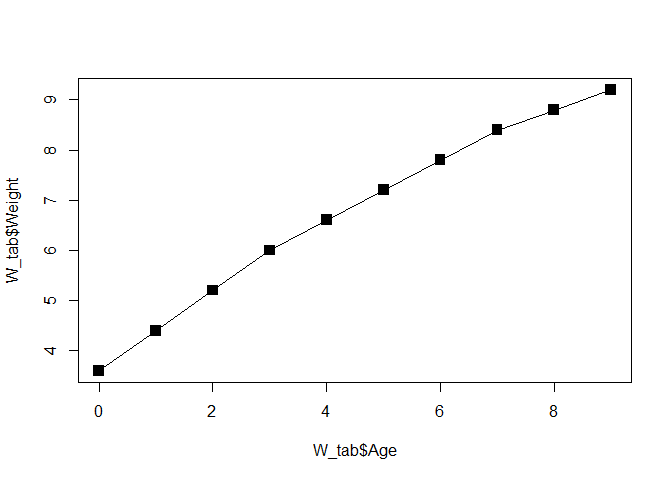<!-- -->

``` r
# Increase width of line with lwd=2

plot(W_tab$Age, W_tab$Weight, type="o", pch=15, cex=1.5, lwd=2)
```

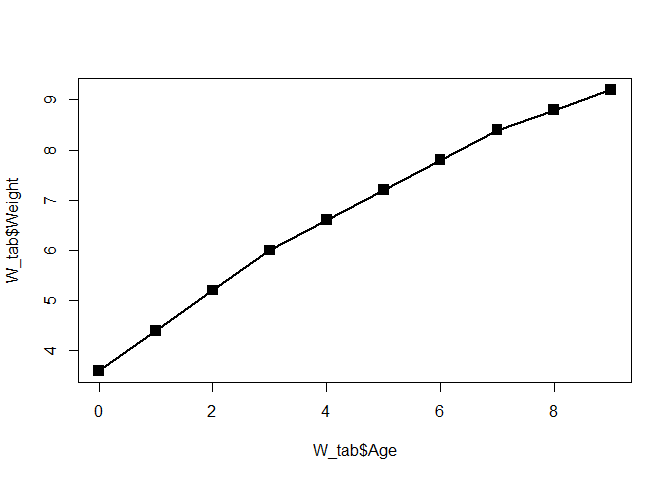<!-- -->

``` r
# Change y axis limits (min and max of plot) to scale ylim=c(2,10) in this case

plot(W_tab$Age, W_tab$Weight, type="o", pch=15, cex=1.5, lwd=2, ylim=c(2,10))
```

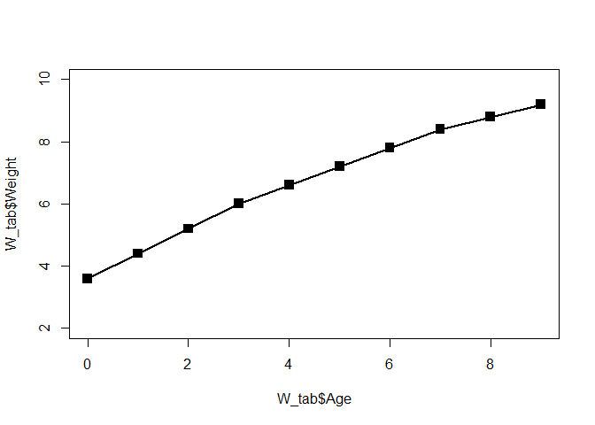<!-- -->

``` r
# Change axes labels ,xlab = "title" ylab = "title"

plot(W_tab$Age, W_tab$Weight, type="o", pch=15, cex=1.5, lwd=2, ylim=c(2,10), xlab="Age (months of the year)", ylab="Weight (kg)")
```

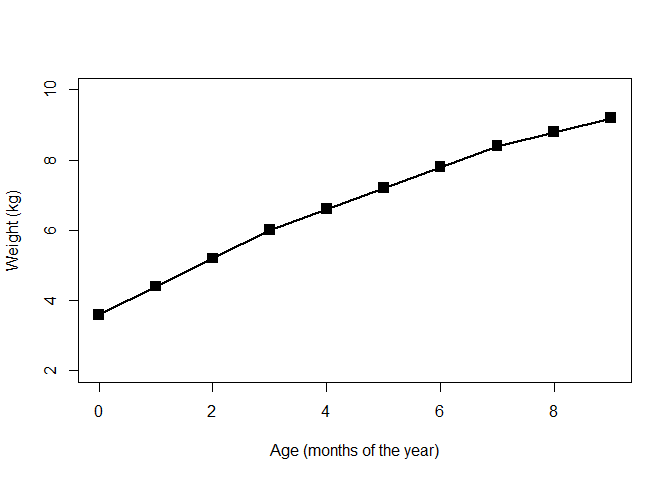<!-- -->

``` r
# Add main title with main = "title"

plot(W_tab$Age, 
     W_tab$Weight, 
     type="o", pch=15, 
     cex=1.5, lwd=2, 
     ylim=c(2,10), 
     xlab="Age (months of the year)", ylab="Weight (kg)", 
     main = "Big Babies v Old Babies")
```

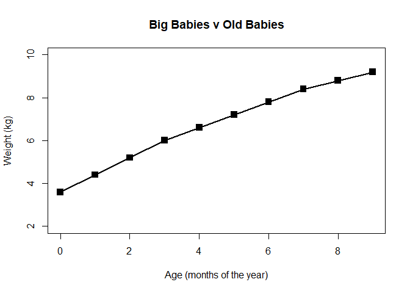<!-- -->

``` r
# Change color with col = ""

plot(W_tab$Age, 
     W_tab$Weight, 
     type="o", pch=15, 
     cex=1.5, lwd=2, 
     ylim=c(2,10), 
     xlab="Age (months of the year)", ylab="Weight (kg)", 
     main = "Big Babies v Old Babies", col="blue")
```

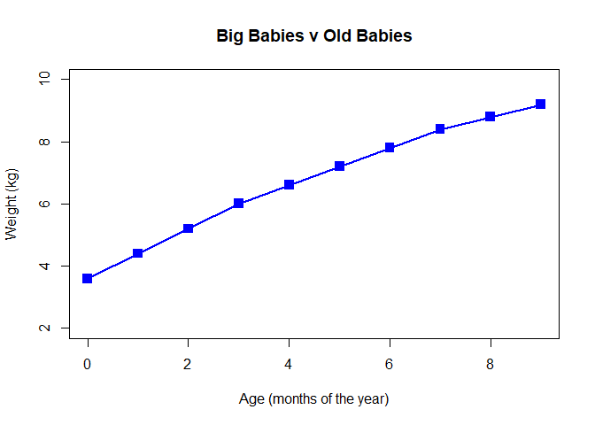<!-- -->

``` r
# Barplot; Assign file to variable first, then set sep ="\t" to get columns assigned appropriately and then header = TRUE

feat <- read.table("bimm143_05_rstats/feature_counts.txt",
           sep = "\t", header = TRUE)

# SHORTCUT to ^^^^^ is; use read.delim since it's already sep="\t" and header = TRUE; SAVES TIME, EFFICIENT

mouse <- read.delim("bimm143_05_rstats/feature_counts.txt")

#Barplot; data we want is in Count column, so use barplot(title$column)

barplot(mouse$Count)
```

<!-- -->

``` r
# Change the orientation of the bars; las = forces titles to be horizontal

barplot(mouse$Count, horiz=TRUE, las =1)
```

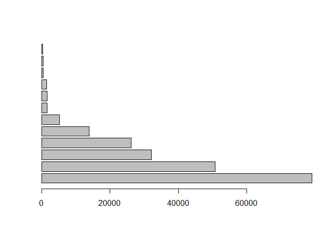<!-- -->

``` r
# Add title and axes

barplot(mouse$Count, horiz = TRUE, las =1, 
        names.arg = mouse$Feature)

# par mar to set margins (in order from bottom, L, top, R)

par(mar=c(5,5,5,5))
barplot(mouse$Count, horiz = TRUE, las =1, 
        names.arg = mouse$Feature)
```

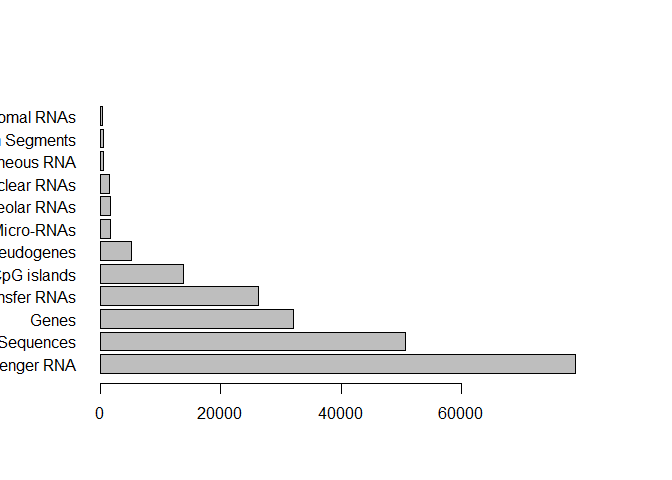<!-- -->

``` r
# Color Vectors

MF_counts <- read.delim("bimm143_05_rstats/male_female_counts.txt")

# Barplot of ^^^

barplot(MF_counts$Count)
```

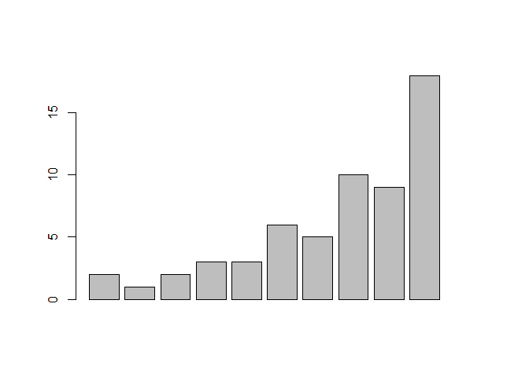<!-- -->

``` r
# Make all bars different colors using rainbow() fxn

barplot(MF_counts$Count, col = rainbow(nrow(MF_counts)))
```

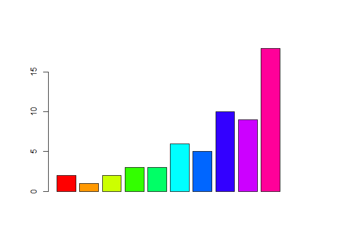<!-- -->

``` r
# to determine number of columns and therefore how many rainbows you should use

nrow(MF_counts)
```

    ## [1] 10

``` r
# Alternate colors of ea column using c("col","col")

barplot(MF_counts$Count, col = c("black","orange"))
```

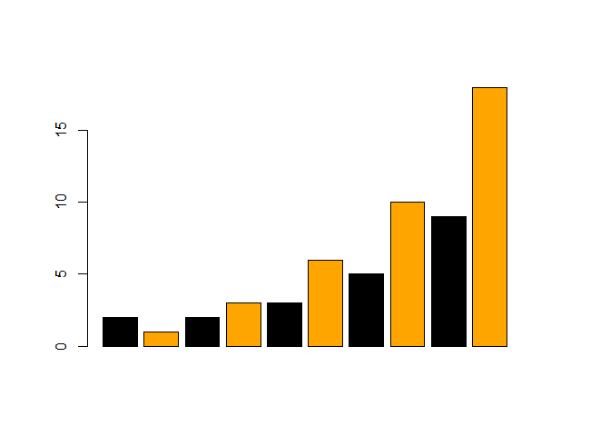<!-- -->

``` r
# Add labels/title
barplot(MF_counts$Count, col = c("black","orange"),
        names.arg =  MF_counts$Sample,
      ylab = "Count", las = 2, main = "Spooky M v F")
```

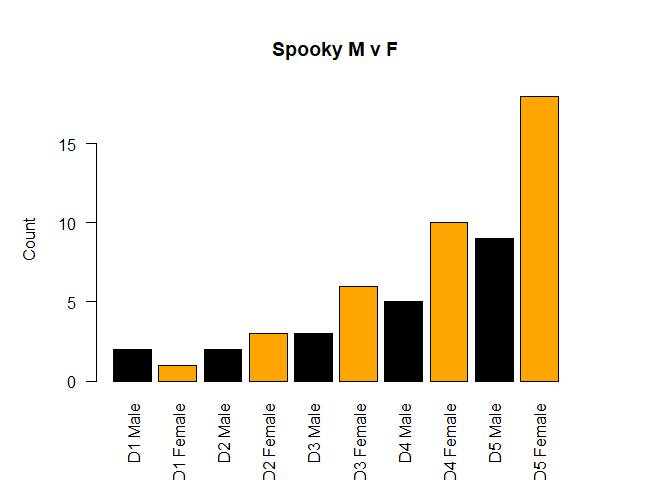<!-- -->
