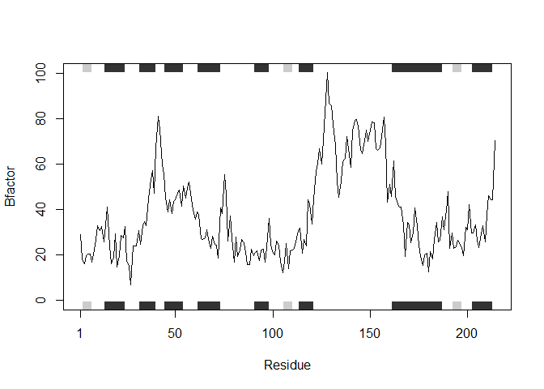

Improving Analysis Code HW 6
================
Justin Alvarez

``` r
# Code to be improved

# install.packages("bio3d")

# library(bio3d)

# Running Chonky code; Code to be Revised

library(bio3d)
s1 <- read.pdb("4AKE") # kinase with drug
```

    ##   Note: Accessing on-line PDB file

``` r
s2 <- read.pdb("1AKE") # kinase no drug
```

    ##   Note: Accessing on-line PDB file
    ##    PDB has ALT records, taking A only, rm.alt=TRUE

``` r
s3 <- read.pdb("1E4Y") # kinase with drug
```

    ##   Note: Accessing on-line PDB file

``` r
s1.chainA <- trim.pdb(s1, chain="A", elety="CA")
s2.chainA <- trim.pdb(s2, chain="A", elety="CA")
s3.chainA <- trim.pdb(s3, chain="A", elety="CA")
s1.b <- s1.chainA$atom$b
s2.b <- s2.chainA$atom$b
s3.b <- s3.chainA$atom$b
plotb3(s1.b, sse=s1.chainA, typ="l", ylab="Bfactor")
```

<!-- -->

``` r
plotb3(s2.b, sse=s2.chainA, typ="l", ylab="Bfactor")
```

<!-- -->

``` r
plotb3(s3.b, sse=s3.chainA, typ="l", ylab="Bfactor")
```

<!-- -->

``` r
trim.pdb(s1, chain="A",elety="CA")
```

    ## 
    ##  Call:  trim.pdb(pdb = s1, chain = "A", elety = "CA")
    ## 
    ##    Total Models#: 1
    ##      Total Atoms#: 214,  XYZs#: 642  Chains#: 1  (values: A)
    ## 
    ##      Protein Atoms#: 214  (residues/Calpha atoms#: 214)
    ##      Nucleic acid Atoms#: 0  (residues/phosphate atoms#: 0)
    ## 
    ##      Non-protein/nucleic Atoms#: 0  (residues: 0)
    ##      Non-protein/nucleic resid values: [ none ]
    ## 
    ##    Protein sequence:
    ##       MRIILLGAPGAGKGTQAQFIMEKYGIPQISTGDMLRAAVKSGSELGKQAKDIMDAGKLVT
    ##       DELVIALVKERIAQEDCRNGFLLDGFPRTIPQADAMKEAGINVDYVLEFDVPDELIVDRI
    ##       VGRRVHAPSGRVYHVKFNPPKVEGKDDVTGEELTTRKDDQEETVRKRLVEYHQMTAPLIG
    ##       YYSKEAEAGNTKYAKVDGTKPVAEVRADLEKILG
    ## 
    ## + attr: atom, helix, sheet, seqres, xyz,
    ##         calpha, call

``` r
# call library so all packages are available to u

library(bio3d)


# x <- se
# CODE ATTEMPT???
# Consdiering original line of code

# s1 <- read.pdb("4AKE") # kinase with drug

# Showing intention of code

# s1 <- readsp(s1)

# Using working code snippet to simplify/reduce calculation duplication

# x <- read.pdb(code) # kinase with drug

# Call library to ensure the read.pdb(); trim.pdb(), and all other functions in library(bio3d) work properly

library(bio3d)

readsp <- function(code) {
  # Read code with read.pdb and assign the result x
  x <- read.pdb(code)
  # trim code that we just read, keeping same parameters and assigning the trimmed code to y
  y <- trim.pdb(x, chain="A", elety="CA")
  # assigning results of the above trimmed function to z and specifying the information in the b column of the atom row 
  z <- y$atom$b
  # Plot the results of z while also keeping the same parameters from the original analysis code
  plotb3(z, sse=y, typ="l", ylab="Bfactor")
}

readsp("4AKE")
```

    ##   Note: Accessing on-line PDB file

    ## Warning in get.pdb(file, path = tempdir(), verbose = FALSE): C:
    ## \Users\Justin\AppData\Local\Temp\Rtmpk72ACp/4AKE.pdb exists. Skipping
    ## download

<!-- -->

``` r
readsp("1AKE")
```

    ##   Note: Accessing on-line PDB file

    ## Warning in get.pdb(file, path = tempdir(), verbose = FALSE): C:
    ## \Users\Justin\AppData\Local\Temp\Rtmpk72ACp/1AKE.pdb exists. Skipping
    ## download

    ##    PDB has ALT records, taking A only, rm.alt=TRUE

<!-- -->
