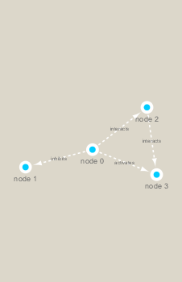

```{r setup, include=FALSE}
knitr::opts_chunk$set(echo = TRUE)
```


Installing stuff

```{r, eval=FALSE}
install.packages("RColorBrewer")
BiocManager::install("RCy3")
install.packages("igraph")


```

```{r}
# Then calling it

library(RCy3)
library(igraph)
library(RColorBrewer)
```


# Testing Cytoscape Connection

```{r}

library(RCy3)

# Test the connection to Cytoscape.
cytoscapePing()


cytoscapeVersionInfo()
```


```{r}
g <- makeSimpleIgraph()
createNetworkFromIgraph(g,"myGraph")

plot(g)
```

If you turn to your Cytoscape window you should now see a simple 4 vertex and 4 edge network displayed (see below).

We can include this Cytoscape rendered network image in our report with the following code:

```{r}
# 

fig <- exportImage(filename="demo", type="png", height=350)

knitr::include_graphics("./demo.png")


```


Switching Styles

```{r}
setVisualStyle("Marquee")


```

If you turn to your Cytoscape window you should now see an updated stylized network displayed (see below).

```{r}

fig <- exportImage(filename="demo_marquee", type="png", height=350)




```


Find out other styles available

```{r}

styles <- getVisualStyleNames()
styles


```


# Reading Our Metagenomics Data

```{r}

## scripts for processing located in "inst/data-raw/"
prok_vir_cor <- read.delim("virus_prok_cor_abundant.tsv", stringsAsFactors = FALSE)

## Have a peak at the first 6 rows
head(prok_vir_cor)


```


Using igraph to convert co-occurence dataframe into a network that can be sent to Cytoscape; Our graph is undirected so we set `directed = FALSE` 

```{r}

g <- graph.data.frame(prok_vir_cor, directed = FALSE)

```

We can check the class of our new object g and see that is is of class igraph. Therefor the `print.igraph()` function will be called when we type it’s name allowing us have an informative overview of the graph structure.

```{r}
class(g)

g
```

Plotting g

```{r}
plot(g)
```

This is a hot-mess! Lets turn of the blue text labels; just to make it look better


```{r}

plot(g, vertex.label=NA)

```


```{r}
plot(g, vertex.size=3, vertex.label=NA)

```


The rest of the hands on 2 worksheet is available in Lecture 17 to finish individually if desired.


