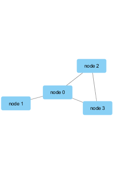
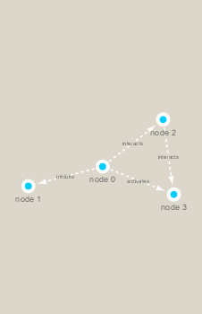

Installing stuff. 


```r
install.packages("RColorBrewer")
BiocManager::install("RCy3")
install.packages("igraph")
```
Run the above code in console.


```r
# Then calling it

library(RCy3)
library(igraph)
```

```
## 
## Attaching package: 'igraph'
```

```
## The following objects are masked from 'package:stats':
## 
##     decompose, spectrum
```

```
## The following object is masked from 'package:base':
## 
##     union
```

```r
library(RColorBrewer)
```


# Testing Cytoscape Connection
Need to have Cytoscape open simulatneously for this to work.


```r
library(RCy3)

# Test the connection to Cytoscape.
cytoscapePing()
```

```
## [1] "You are connected to Cytoscape!"
```

```r
cytoscapeVersionInfo()
```

```
##       apiVersion cytoscapeVersion 
##             "v1"          "3.7.2"
```


```r
g <- makeSimpleIgraph()
createNetworkFromIgraph(g,"myGraph")
```

```
## Loading data...
## Applying default style...
## Applying preferred layout...
```

```
## networkSUID 
##         123
```

```r
plot(g)
```

<!-- -->

If you turn to your Cytoscape window you should now see a simple 4 vertex and 4 edge network displayed (see below).

We can include this Cytoscape rendered network image in our report with the following code:


```r
# 

fig <- exportImage(filename="demo", type="png", height=350)
```

```
## Warning: This file already exists. A Cytoscape popup 
##                 will be generated to confirm overwrite.
```

```r

```


Switching Styles


```r
setVisualStyle("Marquee")
```

```
##                 message 
## "Visual Style applied."
```

If you turn to your Cytoscape window you should now see an updated stylized network displayed (see below).


```r
fig <- exportImage(filename="demo_marquee", type="png", height=350)
```

```
## Warning: This file already exists. A Cytoscape popup 
##                 will be generated to confirm overwrite.
```

```r

```


Find out other styles available


```r
styles <- getVisualStyleNames()
styles
```

```
##  [1] "Directed"             "default black"        "Curved"              
##  [4] "Minimal"              "Solid"                "Gradient1"           
##  [7] "default"              "Sample2"              "size_rank_0"         
## [10] "Sample1"              "BioPAX"               "Nested Network Style"
## [13] "Marquee"              "Ripple"               "Universe"            
## [16] "size_rank"            "Big Labels"           "BioPAX_SIF"          
## [19] "Sample3"
```


# Reading Our Metagenomics Data


```r
## scripts for processing located in "inst/data-raw/"
prok_vir_cor <- read.delim("virus_prok_cor_abundant.tsv", stringsAsFactors = FALSE)

## Have a peak at the first 6 rows
head(prok_vir_cor)
```

```
##       Var1          Var2    weight
## 1  ph_1061 AACY020068177 0.8555342
## 2  ph_1258 AACY020207233 0.8055750
## 3  ph_3164 AACY020207233 0.8122517
## 4  ph_1033 AACY020255495 0.8487498
## 5 ph_10996 AACY020255495 0.8734617
## 6 ph_11038 AACY020255495 0.8740782
```


Using igraph to convert co-occurence dataframe into a network that can be sent to Cytoscape; Our graph is undirected so we set `directed = FALSE` 


```r
g <- graph.data.frame(prok_vir_cor, directed = FALSE)
```

We can check the class of our new object g and see that is is of class igraph. Therefor the `print.igraph()` function will be called when we type it’s name allowing us have an informative overview of the graph structure.


```r
class(g)
```

```
## [1] "igraph"
```

```r
g
```

```
## IGRAPH 57d4893 UNW- 845 1544 -- 
## + attr: name (v/c), weight (e/n)
## + edges from 57d4893 (vertex names):
##  [1] ph_1061 --AACY020068177 ph_1258 --AACY020207233
##  [3] ph_3164 --AACY020207233 ph_1033 --AACY020255495
##  [5] ph_10996--AACY020255495 ph_11038--AACY020255495
##  [7] ph_11040--AACY020255495 ph_11048--AACY020255495
##  [9] ph_11096--AACY020255495 ph_1113 --AACY020255495
## [11] ph_1208 --AACY020255495 ph_13207--AACY020255495
## [13] ph_1346 --AACY020255495 ph_14679--AACY020255495
## [15] ph_1572 --AACY020255495 ph_16045--AACY020255495
## + ... omitted several edges
```

Plotting g


```r
plot(g)
```

<!-- -->

This is a hot-mess! Lets turn of the blue text labels; just to make it look better


```r
plot(g, vertex.label=NA)
```

<!-- -->


```r
plot(g, vertex.size=3, vertex.label=NA)
```

<!-- -->


The rest of the hands on 2 worksheet is available in Lecture 17 to finish individually if desired.


